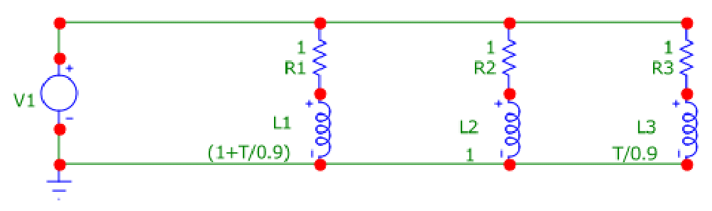

# Simple-Circuit-Equivalents-for-the-Constant-Phase-Element

Supplementary information to accompany the paper Sverre Holm, Thomas Holm, and Ørjan Grøttem Martinsen. 
["Simple circuit equivalents for the constant phase element."](https://doi.org/10.1371/journal.pone.0248786) 
PloS one 16.3 (2021): e0248786. 

The code is for a Microcap *.cir file that produces
the following circuit diagram with time-varying inductances and sets up the simulation.

The Micro-Cap software has been freely available since version 12.2.0.0, 4
July 2019. See http://www.spectrum-soft.com/index.shtm.

## Abstract

The constant phase element (CPE) is a capacitive element with a
frequency-independent negative phase between current and voltage which interpolates
between a capacitor and a resistor. It is used extensively to model the complexity of the
physics in e.g. the bioimpedance and electrochemistry fields. There is also a similar
element with a positive phase angle, and both the capacitive and inductive CPEs are
members of the family of fractional circuit elements or fractance. The physical meaning
of the CPE is only partially understood and many consider it an idealized circuit
element. The goal here is to provide alternative equivalent circuits, which may give rise
to better interpretations of the fractance.

Both the capacitive and the inductive CPEs can be interpreted in the time-domain,
where the impulse and step responses are temporal power laws. Here we show that the
current impulse responses of the capacitive CPE is the same as that of a simple
time-varying series RL-circuit where the inductor's value increases linearly with time.
Similarly, the voltage response of the inductive CPE corresponds to that of a simple
parallel RC circuit where the capacitor's value increases linearly with time. We use the
Micro-Cap circuit simulation program, which can handle time-varying circuits, for
independent verification. The simulation corresponds exactly to the expected response
from the proposed equivalents within 0.1% error. The realization with time-varying
components correlates with known time-varying properties in applications, and may
lead to a better understanding of the link between CPE and applications.
